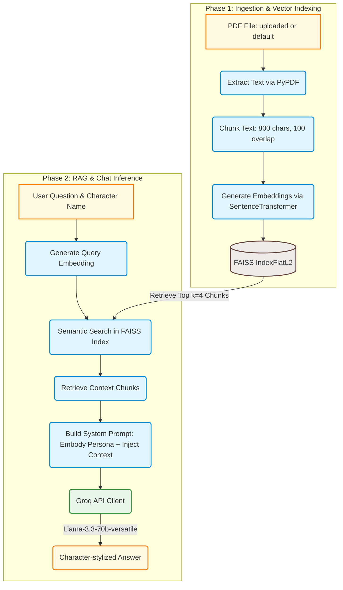

# DocQA 

DocQA is a specialized RAG system built with FastAPI, FAISS, Sentence-Transformers, and Groq. 
The application allows users to upload any book or story PDF, index its content, and then chat with a selected character from that book. The model responds in the style, voice, and characteristic tone of that character, grounded strictly in the factual context extracted from the document.

---

## System Flow

The diagram below illustrates the two main processes of the DocQA architecture: **1) Ingestion & Vector Indexing**, and **2) Retrieval-Augmented Generation (RAG) & Chat Inference**.



### Detailed Pipeline Breakdown

1. **Ingestion & Vector Indexing (`src/utils/pdf_utils.py`, `src/vector_store.py`)**:
   * **PDF Text Extraction**: Extracts text from the uploaded PDF document pages sequentially.
   * **Text Chunking**: Splits raw text into manageable chunks of 800 characters with a sliding overlap of 100 characters to maintain context boundaries.
   * **Embedding Generation**: Encodes text chunks into dense vectors using the pre-trained Hugging Face model `all-MiniLM-L6-v2`.
   * **Vector Storage**: Indexes and stores these embeddings in memory utilizing a FAISS `IndexFlatL2` index for lightning-fast Euclidean distance search.

2. **RAG & Chat Inference (`src/persona.py`, `src/main.py`)**:
   * **Query Encoding**: Converts the user's input question into a vector using the same SentenceTransformer model.
   * **Nearest Neighbor Search**: Queries the FAISS index to extract the `k=4` most semantically relevant text chunks.
   * **Prompt Construction**: Generates a custom system prompt directing the LLM to embody the target character, follow their speech style, and ground their knowledge strictly on the retrieved context chunks (refusing to invent facts if they lie outside the text).
   * **Inference**: Submits the constructed prompt and query to Llama-3.3-70b-versatile via Groq's high-speed API, returning the final stylized character response.

---

## Directory Layout

```text
DocQA/
├── data/
│   └── the_lighthouse_keepers_secret.pdf   # Sample story PDF used for startup auto-indexing
├── src/
│   ├── __init__.py
│   ├── main.py                             # FastAPI server & routes (/upload, /chat)
│   ├── persona.py                          # Prompt engineering & Groq Client setup
│   ├── vector_store.py                     # Embedding wrapper & FAISS index handlers
│   └── utils/
│       ├── __init__.py
│       └── pdf_utils.py                    # PDF readers & text splitter utilities
├── tests/
│   ├── __init__.py
│   └── test_sanity.py                      # Sanity check test script
├── uploads/                                # Target folder for uploaded books at runtime
├── .env                                    # Local environment secrets (Git ignored)
├── .env.example                            # Configuration environment template
├── .gitignore                              # Git exclusion file
├── requirements.txt                        # Dependency lists
└── README.md                               # Project documentation
```

---

## Installation & Setup

1. **Clone the repository**:
   ```bash
   git clone <your-repo-url>
   cd DocQA
   ```

2. **Create and activate a virtual environment**:
   * **Windows (PowerShell)**:
     ```powershell
     python -m venv venv
     .\venv\Scripts\activate
     ```
   * **macOS/Linux**:
     ```bash
     python -m venv venv
     source venv/bin/activate
     ```

3. **Install the required packages**:
   ```bash
   pip install -r requirements.txt
   ```

4. **Add environment variables**:
   Create a `.env` file in the root directory and add your Groq API key:
   ```env
   GROQ_API_KEY=your_groq_api_key_here
   ```

---

## How to Run & Verify

### 1. Verify index functionality (Sanity check)
Run the sanity test script to make sure the pipeline builds, embeds, and runs nearest-neighbor query retrieval:
```bash
python -m tests.test_sanity
```

### 2. Start the FastAPI API Server
Launch the FastAPI development environment:
```bash
uvicorn src.main:app --reload
```
Once the server is running, you can explore, test, and execute calls using the built-in swagger interface at [http://127.0.0.1:8000/docs](http://127.0.0.1:8000/docs).

---

## API Documentation

* **`POST /upload`**: Replaces the currently indexed book with a new uploaded PDF.
  * **Request**: `file` (multipart/form-data)
  * **Response**: `{"status": "ok", "chunks_indexed": 12}`

* **`POST /chat`**: Ask questions and chat with the character.
  * **Request** (Form URL encoded):
    * `character_name` (string): The exact name of the character to interact with (e.g. `Silas Vane`).
    * `question` (string): The query statement or prompt.
  * **Response**: `{"character": "Silas Vane", "answer": "..."}`
